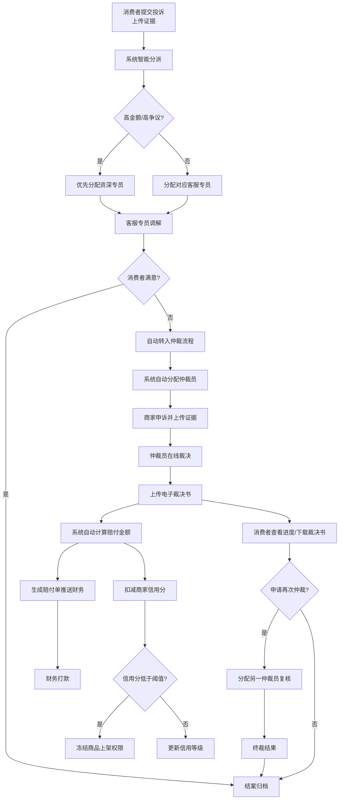

## 1. 产品概述

消费者保障与争议仲裁系统是大型电商平台的核心服务治理系统，通过数字化流程实现消费纠纷的高效处理与公正裁决，涵盖投诉提交、智能分派、多方协同、在线仲裁、自动赔付、信用管理等全链路能力。

- 主要目的：构建公开透明、高效公正的消费者权益保障机制，降低纠纷处理成本，提升平台信任度
- 目标用户：消费者、商家、客服专员、仲裁员、平台运营五种角色
- 市场价值：提升用户体验与满意度，降低人工处理成本80%，纠纷处理时效缩短60%

## 2. 核心特性

### 2.1 用户角色

| 角色 | 注册方式 | 核心权限 |
|------|----------|----------|
| 消费者 | 平台账号登录 | 提交投诉、上传证据、查看进度、下载裁决书、申请再次仲裁 |
| 商家 | 商家认证入驻 | 查看投诉、在线申诉、上传反驳证据、查看信用等级、接收处罚通知 |
| 客服专员 | 内部员工账号 | 接收分派投诉、初步调解、上传处理记录、升级仲裁申请 |
| 仲裁员 | 专业认证账号 | 接收仲裁案件、查看双方证据、在线裁决、上传电子裁决书、复核再次仲裁 |
| 平台运营 | 管理员账号 | 配置赔付规则、设置仲裁时效、管理信用分阈值、查看运营报表、系统参数配置 |

### 2.2 功能模块

1. **统一登录与角色选择页**：身份认证、角色切换、工作台入口
2. **消费者工作台**：投诉中心、进度查询、裁决书管理、个人中心
3. **商家工作台**：投诉处理、申诉管理、信用中心、赔付记录
4. **客服专员工作台**：待处理投诉、调解记录、仲裁升级、绩效统计
5. **仲裁员工作台**：仲裁案件池、裁决管理、再次仲裁复核、裁决书模板
6. **平台运营控制台**：规则配置中心、信用体系管理、数据报表、系统监控
7. **消息通知中心**：实时消息推送、待办提醒、凭证下载
8. **财务报表中心**：月度自动统计、运营对比分析、管理层推送

### 2.3 页面详情

| 页面名称 | 模块名称 | 功能描述 |
|---------|----------|----------|
| 登录页 | 身份认证模块 | 账号密码登录、角色选择、验证码验证 |
| 消费者首页 | 投诉提交模块 | 选择投诉订单、选择投诉类型、填写问题描述、多证据上传（照片/聊天记录）、提交投诉 |
| 消费者首页 | 投诉列表模块 | 我的投诉列表、状态筛选、搜索、投诉详情入口 |
| 消费者首页 | 进度追踪模块 | 投诉处理时间线、当前处理人、剩余时效、操作按钮 |
| 消费者首页 | 裁决书模块 | 裁决书列表、在线预览、PDF下载、再次仲裁申请 |
| 商家首页 | 待处理投诉模块 | 收到的投诉列表、投诉详情查看、申诉入口、证据上传 |
| 商家首页 | 信用中心模块 | 实时信用等级展示、信用分变动记录、处罚历史、冻结状态提示 |
| 商家首页 | 赔付记录模块 | 赔付单列表、赔付金额、支付状态、凭证下载 |
| 客服专员首页 | 待分派池模块 | 智能分派队列、高优先级标识、一键领取、批量分配 |
| 客服专员首页 | 调解处理模块 | 投诉详情、双方沟通记录、调解方案录入、满意度确认、仲裁升级 |
| 客服专员首页 | 绩效看板模块 | 日处理量、调解成功率、平均处理时长 |
| 仲裁员首页 | 仲裁案件池模块 | 待仲裁案件、高金额标识、自动分配、领取案件 |
| 仲裁员首页 | 裁决工作台 | 双方证据对比、在线裁决、责任判定、赔付金额自动计算、裁决书生成 |
| 仲裁员首页 | 再次仲裁模块 | 复核案件池、独立裁决、终裁标识 |
| 平台运营首页 | 规则配置模块 | 品类赔付规则设置、仲裁时效配置、信用分阈值管理 |
| 平台运营首页 | 数据报表模块 | 投诉率统计、赔付总额分析、仲裁时效报表、多维度对比 |
| 消息通知中心 | 消息列表 | 实时消息推送、分类筛选、已读/未读状态、一键跳转详情、凭证下载 |

## 3. 核心流程

### 3.1 投诉处理主流程

消费者在线提交投诉订单并上传问题照片、聊天记录等证据 → 系统根据投诉类型（商品质量、物流延误、虚假描述等）自动分派 → 高金额或高争议优先分配资深专员 → 客服专员初步调解 → 消费者满意则结案 → 消费者不满意则自动转入仲裁流程 → 系统自动分配仲裁员 → 商家在线申诉并上传反驳证据 → 仲裁员查看双方材料后在线裁决 → 上传电子裁决书 → 系统根据责任判定自动计算赔付金额 → 生成赔付单推送财务打款 → 自动扣减商家信用分 → 信用分低于阈值自动冻结新商品上架权限 → 消费者可查看仲裁进度并下载裁决书 → 对结果不满意可申请再次仲裁 → 系统自动分配给另一仲裁员复核并将结果视为终裁。

### 3.2 自动处理机制

- **超时未响应**：商家/仲裁员超时未响应自动默认支持消费者
- **月度报表**：每月1号自动统计各品类投诉率、赔付总额和仲裁处理时效，生成运营对比报表推送管理层
- **实时消息**：投诉分派、仲裁裁决、信用变动、赔付完成时推送实时消息提醒相关人员

## 4. 用户界面设计

### 4.1 设计风格

**设计理念：专业可信、高效简洁**

- **主色调**：深邃蓝 `#1e3a5f` 代表专业与信任
- **辅助色**：
  - 警示橙 `#f59e0b` 用于待处理、高优先级标识
  - 成功绿 `#10b981` 用于已完成、满意状态
  - 危险红 `#ef4444` 用于冻结、终裁、赔付状态
  - 信息蓝 `#3b82f6` 用于进行中、通知状态
- **中性色**：碳灰 `#1f2937`、深灰 `#4b5563`、中灰 `#9ca3af`、浅灰 `#f3f4f6`、纯白 `#ffffff`
- **字体**：
  - 标题：`Noto Serif SC` 宋体，传达正式庄重感
  - 正文：`Inter` 无衬线体，保障可读性
  - 数字/金额：`JetBrains Mono` 等宽字体，便于数据对比
- **按钮风格**：直角边框、细微阴影、hover时轻微上浮，体现专业稳重
- **布局风格**：左侧导航栏 + 顶部状态栏 + 主内容区的经典企业级布局，卡片式模块组织
- **图标风格**：线性图标，统一2px描边，保持简洁专业
- **背景**：浅色渐变底 + 微妙网格纹理，增强空间层次感

### 4.2 页面设计概览

| 页面名称 | 模块名称 | UI元素 |
|---------|----------|--------|
| 登录页 | 身份认证 | 居中卡片布局、蓝色渐变背景、浮动装饰图形、输入框焦点动画、角色选择胶囊按钮 |
| 消费者首页 | 投诉提交 | 多步骤向导、拖放上传区（带预览缩略图）、类型选择卡片、实时字数统计 |
| 消费者首页 | 进度追踪 | 垂直时间线组件、状态节点动画、处理人头像卡片、倒计时进度条 |
| 商家首页 | 信用中心 | 大字号信用等级数字、环形进度条、等级徽章、扣分记录列表、冻结状态醒目横幅 |
| 客服专员首页 | 待分派池 | 数据表格、高优先级行高亮、一键操作快捷按钮、批量选择复选框 |
| 仲裁员首页 | 裁决工作台 | 双栏对比布局（消费者vs商家证据）、责任判定滑块、赔付金额计算器、裁决书编辑器 |
| 平台运营首页 | 规则配置 | 分组标签页、表单动态增减、规则卡片拖拽排序、实时预览效果 |
| 平台运营首页 | 数据报表 | 多图表组合（柱状图+折线图+饼图）、日期范围选择器、数据下钻、导出按钮 |
| 消息通知中心 | 消息列表 | 右侧抽屉式设计、未读红点提示、分类筛选标签、一键已读按钮 |

### 4.3 响应式设计

- **设计策略**：Desktop-first，针对不同屏幕尺寸优化
- **桌面端（1920px+）**：完整三栏布局，最大内容宽度1440px
- **笔记本（1280px-1919px）**：标准布局，适当压缩间距
- **平板（768px-1279px）**：导航栏可折叠，主内容单列
- **移动端（<768px）**：底部Tab导航，卡片堆叠，重点信息优先展示
- **触控优化**：所有可点击区域≥48x48px，手势滑动支持时间线翻页

### 4.4 动效设计

- **页面加载**：骨架屏+淡入动画，内容区域错开0.1s依次显现
- **状态变更**：时间线节点点亮动画、数字滚动效果
- **消息通知**：右上角滑入+轻微弹跳，3s后自动收起
- **提交成功**：绿圈勾选动画+成功文案渐显
- **数据更新**：数字变化时的平滑过渡动画
