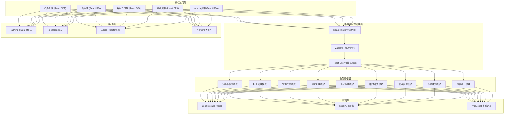
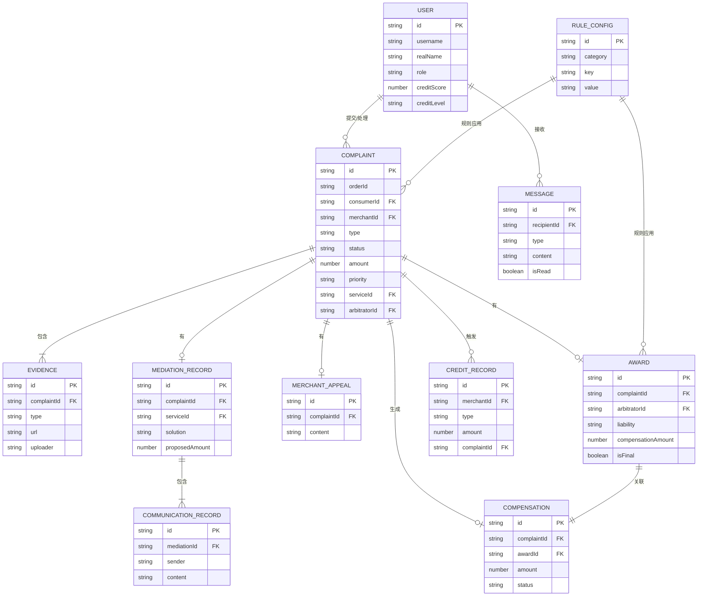

## 1. 架构设计



## 2. 技术栈说明

- **前端框架**：React 18 + TypeScript 5
- **构建工具**：Vite 5
- **路由管理**：React Router v6
- **状态管理**：Zustand 4（轻量级，适合多模块状态隔离）
- **数据请求**：React Query (TanStack Query) + Axios
- **样式方案**：Tailwind CSS 3
- **图标库**：Lucide React
- **图表库**：Recharts
- **数据持久化**：LocalStorage + 自定义加密
- **Mock服务**：MSW (Mock Service Worker) 或 本地JSON数据

## 3. 路由定义

| 路由路径 | 页面名称 | 访问角色 | 功能说明 |
|----------|----------|----------|----------|
| `/login` | 登录页 | 所有 | 身份认证、角色选择 |
| `/consumer` | 消费者工作台首页 | 消费者 | 概览统计、快捷入口 |
| `/consumer/complaints` | 我的投诉列表 | 消费者 | 投诉列表、筛选、搜索 |
| `/consumer/complaints/new` | 提交新投诉 | 消费者 | 多步骤投诉表单、证据上传 |
| `/consumer/complaints/:id` | 投诉详情 | 消费者 | 进度追踪、证据查看、操作按钮 |
| `/consumer/awards` | 裁决书管理 | 消费者 | 裁决书列表、预览、下载、再次仲裁申请 |
| `/merchant` | 商家工作台首页 | 商家 | 概览、信用等级、待办 |
| `/merchant/complaints` | 收到的投诉 | 商家 | 投诉列表、详情、申诉入口 |
| `/merchant/complaints/:id` | 投诉详情与申诉 | 商家 | 查看投诉、在线申诉、上传证据 |
| `/merchant/credit` | 信用中心 | 商家 | 信用分、等级、变动记录、冻结状态 |
| `/merchant/compensations` | 赔付记录 | 商家 | 赔付单列表、金额、状态、凭证下载 |
| `/service` | 客服专员工作台 | 客服专员 | 概览、待办统计 |
| `/service/pool` | 待分派池 | 客服专员 | 分派队列、领取、批量分配 |
| `/service/complaints` | 我的投诉 | 客服专员 | 正在处理的投诉列表 |
| `/service/complaints/:id` | 调解处理 | 客服专员 | 调解记录、方案录入、满意度确认、仲裁升级 |
| `/service/performance` | 绩效统计 | 客服专员 | 处理量、成功率、时效统计 |
| `/arbitrator` | 仲裁员工作台 | 仲裁员 | 概览、案件统计 |
| `/arbitrator/cases` | 仲裁案件池 | 仲裁员 | 待仲裁案件、领取、自动分配 |
| `/arbitrator/cases/:id` | 裁决工作台 | 仲裁员 | 双方证据对比、在线裁决、裁决书生成 |
| `/arbitrator/review` | 再次仲裁复核 | 仲裁员 | 复核案件、终裁处理 |
| `/operator` | 运营控制台首页 | 平台运营 | 数据概览、关键指标 |
| `/operator/rules` | 规则配置中心 | 平台运营 | 赔付规则、时效配置、信用阈值 |
| `/operator/reports` | 数据报表 | 平台运营 | 多维度分析、对比报表、导出 |
| `/operator/system` | 系统管理 | 平台运营 | 用户管理、权限配置 |
| `/messages` | 消息通知中心 | 所有角色 | 消息列表、分类、已读/未读、跳转 |

## 4. 数据模型定义

### 4.1 核心TypeScript类型

```typescript
// 用户类型
type UserRole = 'consumer' | 'merchant' | 'service' | 'arbitrator' | 'operator';

interface User {
  id: string;
  username: string;
  realName: string;
  role: UserRole;
  avatar: string;
  phone: string;
  email: string;
  // 商家特有
  merchantName?: string;
  creditScore?: number;
  creditLevel?: 'A' | 'B' | 'C' | 'D';
  isFrozen?: boolean;
  // 客服/仲裁员特有
  isSenior?: boolean;
  caseCount?: number;
  successRate?: number;
}

// 投诉类型
type ComplaintType = 'quality' | 'logistics' | 'misrepresentation' | 'price' | 'aftersale';
type ComplaintStatus = 'pending' | 'assigned' | 'mediating' | 'mediated' | 'arbitrating' | 'awarded' | 'closed' | 'reject';
type Priority = 'high' | 'medium' | 'low';

interface Complaint {
  id: string;
  orderId: string;
  orderInfo: {
    productName: string;
    productImage: string;
    amount: number;
    orderTime: string;
    merchantId: string;
    merchantName: string;
  };
  consumerId: string;
  consumerName: string;
  type: ComplaintType;
  title: string;
  description: string;
  evidence: Evidence[];
  amount: number;
  priority: Priority;
  status: ComplaintStatus;
  createdAt: string;
  updatedAt: string;
  // 分派信息
  serviceId?: string;
  serviceName?: string;
  assignedAt?: string;
  // 调解信息
  mediationRecord?: MediationRecord;
  consumerSatisfied?: boolean;
  // 仲裁信息
  arbitratorId?: string;
  arbitratorName?: string;
  arbitrationAssignedAt?: string;
  award?: Award;
  isReArbitration?: boolean;
  parentComplaintId?: string;
  finalAward?: boolean;
  // 商家申诉
  merchantAppeal?: MerchantAppeal;
  merchantResponseDeadline?: string;
  merchantTimeout?: boolean;
}

interface Evidence {
  id: string;
  type: 'image' | 'chat' | 'video' | 'document';
  url: string;
  name: string;
  uploadTime: string;
  uploader: 'consumer' | 'merchant';
}

interface MediationRecord {
  id: string;
  serviceId: string;
  content: string;
  solution: string;
  proposedAmount: number;
  createdAt: string;
  communicationRecords: CommunicationRecord[];
}

interface CommunicationRecord {
  id: string;
  sender: 'consumer' | 'merchant' | 'service';
  senderName: string;
  content: string;
  createdAt: string;
}

interface MerchantAppeal {
  id: string;
  content: string;
  evidence: Evidence[];
  submittedAt: string;
}

interface Award {
  id: string;
  arbitratorId: string;
  arbitratorName: string;
  content: string;
  liability: 'consumer' | 'merchant' | 'both';
  merchantLiabilityPercent: number;
  compensationAmount: number;
  documentUrl: string;
  createdAt: string;
  isFinal: boolean;
}

interface Compensation {
  id: string;
  complaintId: string;
  amount: number;
  status: 'pending' | 'paid' | 'failed';
  paidAt?: string;
  voucherUrl?: string;
  createdAt: string;
}

interface CreditRecord {
  id: string;
  merchantId: string;
  type: 'deduct' | 'add';
  amount: number;
  reason: string;
  complaintId?: string;
  createdAt: string;
}

interface Message {
  id: string;
  recipientId: string;
  recipientRole: UserRole;
  type: 'complaint_assigned' | 'mediation_needed' | 'arbitration_needed' | 'award_published' | 'credit_changed' | 'compensation_done' | 'system' | 'timeout_warning';
  title: string;
  content: string;
  relatedId: string;
  relatedType: 'complaint' | 'award' | 'compensation' | 'credit';
  isRead: boolean;
  createdAt: string;
}

interface RuleConfig {
  id: string;
  category: 'compensation' | 'timeline' | 'credit';
  subCategory: string;
  key: string;
  value: string | number | boolean;
  description: string;
  updatedAt: string;
  updatedBy: string;
}

interface ReportData {
  period: string;
  category: string;
  complaintCount: number;
  complaintRate: number;
  totalCompensation: number;
  avgArbitrationTime: number;
  mediationSuccessRate: number;
}
```

### 4.2 ER图



## 5. 前端架构分层

```
src/
├── assets/              # 静态资源
├── components/          # 公共组件
│   ├── common/         # 基础组件（Button, Input, Modal等）
│   ├── layout/         # 布局组件（Sidebar, Header, Content等）
│   └── business/       # 业务组件（Timeline, EvidenceUpload, AwardCard等）
├── pages/              # 页面组件
│   ├── Login/
│   ├── Consumer/
│   ├── Merchant/
│   ├── Service/
│   ├── Arbitrator/
│   ├── Operator/
│   └── Messages/
├── hooks/              # 自定义Hooks
│   ├── useAuth.ts
│   ├── useComplaint.ts
│   ├── useMessage.ts
│   └── usePermission.ts
├── store/              # 状态管理
│   ├── authStore.ts
│   ├── complaintStore.ts
│   ├── messageStore.ts
│   └── configStore.ts
├── services/           # API服务
│   ├── auth.ts
│   ├── complaint.ts
│   ├── arbitration.ts
│   ├── credit.ts
│   ├── message.ts
│   └── report.ts
├── types/              # TypeScript类型定义
│   ├── index.ts
│   ├── complaint.ts
│   ├── user.ts
│   └── message.ts
├── mock/               # Mock数据
│   ├── data/
│   └── handlers.ts
├── utils/              # 工具函数
│   ├── format.ts       # 金额、日期格式化
│   ├── storage.ts      # 本地存储
│   ├── permission.ts   # 权限判断
│   └── calculation.ts  # 赔付计算
├── router/             # 路由配置
│   └── index.tsx
├── styles/             # 全局样式
│   └── index.css
├── App.tsx
└── main.tsx
```

## 6. 关键业务逻辑实现

### 6.1 智能分派算法

```typescript
// 根据投诉类型、金额、优先级自动分派
function autoAssignComplaint(complaint: Complaint): { serviceId: string; isSenior: boolean } {
  const isHighPriority = complaint.priority === 'high' || complaint.amount > 10000;
  const typeMapping: Record<ComplaintType, string[]> = {
    quality: ['service_quality_001', 'service_quality_002'],
    logistics: ['service_logistics_001'],
    misrepresentation: ['service_mis_001'],
    price: ['service_price_001'],
    aftersale: ['service_aftersale_001'],
  };
  
  const availableServices = typeMapping[complaint.type] || typeMapping.quality;
  const serviceList = isHighPriority 
    ? availableServices.filter(id => getServiceById(id)?.isSenior)
    : availableServices;
  
  // 负载均衡：分配给当前处理量最少的专员
  const targetService = serviceList
    .map(id => ({ id, load: getServiceLoad(id) }))
    .sort((a, b) => a.load - b.load)[0];
    
  return {
    serviceId: targetService.id,
    isSenior: isHighPriority,
  };
}
```

### 6.2 赔付金额自动计算

```typescript
function calculateCompensation(
  complaint: Complaint,
  liability: 'consumer' | 'merchant' | 'both',
  merchantLiabilityPercent: number
): number {
  const { amount } = complaint;
  const baseAmount = amount;
  
  // 获取品类赔付规则
  const rules = getCompensationRules(complaint.type);
  const maxMultiple = rules.maxMultiple || 3;
  const minCompensation = rules.minCompensation || 50;
  
  let compensation = 0;
  
  switch (liability) {
    case 'merchant':
      compensation = baseAmount;
      break;
    case 'both':
      compensation = baseAmount * (merchantLiabilityPercent / 100);
      break;
    case 'consumer':
      compensation = 0;
      break;
  }
  
  // 规则限制
  compensation = Math.min(compensation, baseAmount * maxMultiple);
  compensation = Math.max(compensation, minCompensation);
  
  return Math.round(compensation * 100) / 100;
}
```

### 6.3 信用分管理

```typescript
function updateCreditScore(
  merchantId: string,
  complaint: Complaint,
  award: Award
): { newScore: number; newLevel: string; isFrozen: boolean } {
  const merchant = getMerchant(merchantId);
  const deductRules = getCreditDeductRules(award.liability);
  
  let deductAmount = 0;
  if (award.liability === 'merchant') {
    deductAmount = deductRules.full;
  } else if (award.liability === 'both') {
    deductAmount = deductRules.partial;
  }
  
  // 高金额投诉加倍扣分
  if (complaint.amount > 10000) {
    deductAmount *= 2;
  }
  
  // 超时未响应额外扣分
  if (complaint.merchantTimeout) {
    deductAmount += deductRules.timeout;
  }
  
  const newScore = Math.max(0, merchant.creditScore - deductAmount);
  const newLevel = calculateCreditLevel(newScore);
  const threshold = getCreditThreshold();
  const isFrozen = newScore < threshold;
  
  return { newScore, newLevel, isFrozen };
}
```

### 6.4 超时自动处理

```typescript
// 定时任务：检查商家超时未申诉
function checkMerchantTimeout(): Complaint[] {
  const now = new Date();
  return getAllComplaints()
    .filter(c => 
      c.status === 'assigned' && 
      c.merchantResponseDeadline && 
      new Date(c.merchantResponseDeadline) < now &&
      !c.merchantAppeal
    )
    .map(complaint => {
      // 自动默认支持消费者
      complaint.merchantTimeout = true;
      complaint.status = 'arbitrating';
      // 自动分配仲裁员
      const arbitrator = autoAssignArbitrator(complaint);
      complaint.arbitratorId = arbitrator.id;
      complaint.arbitratorName = arbitrator.name;
      return complaint;
    });
}
```
